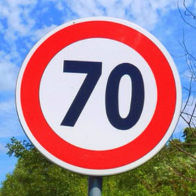
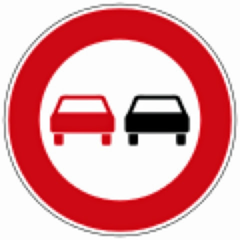
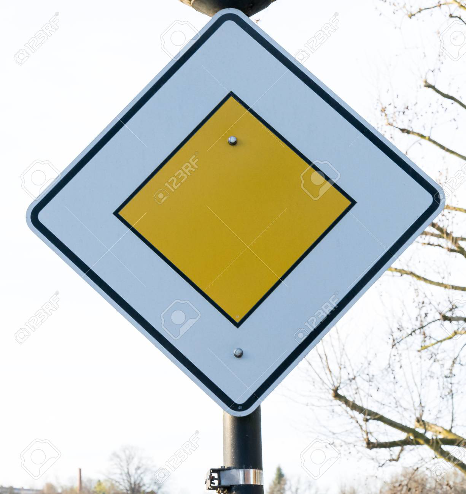
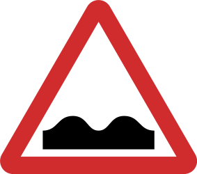
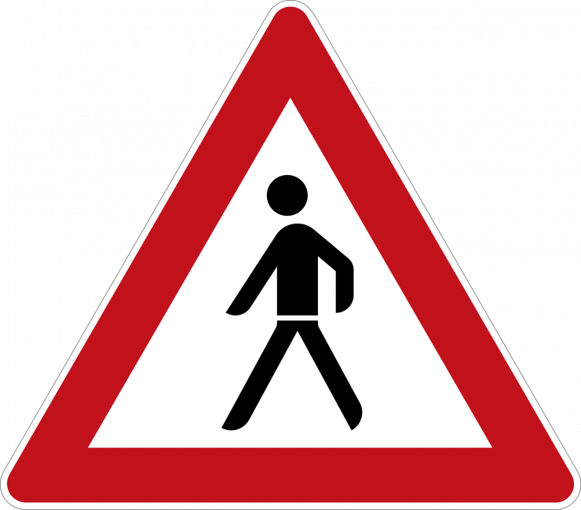

# **Traffic Sign Classifier**

This project was done as part of the [Udacity Self-Driving Car Nanodegree](http://www.udacity.com/drive)

---

The goals / steps of this project are the following:
* Load the data set from [INI](http://benchmark.ini.rub.de/?section=gtsrb&subsection=dataset)
* Explore, summarize and visualize the data set
* Design, train and test a model architecture
* Use the model to make predictions on new images
* Analyze the softmax probabilities of the new images
* Summarize the results with a written report

[//]: # (Image References)

[image1]: ./writeup_images/dataset_histogram.png "Dataset Visualization"
[image2]: ./writeup_images/training_image.png "Original Image"
[image3]: ./writeup_images/training_image_gray.png "Preprocessed Image"
[image4]: ./images/4-speed_limit_70.png "Speed Limit: 70 Sign"
[image5]: ./images/9-no_passing.png "No Passing Sign"
[image6]: ./images/12-priority_road.png "Priority Road Sign"
[image7]: ./images/22-bumpy_road.png "Bumpy Road Sign"
[image8]: ./images/27-pedestrians.png "Pedestrians Sign"

---

### Data Set Summary & Exploration

#### 1. Provide a basic summary of the data set. In the code, the analysis should be done using python, numpy and/or pandas methods rather than hardcoding results manually.

I used the pandas library to calculate summary statistics of the traffic
signs data set:

* The size of training set is **34799**
* The size of the validation set is **4410**
* The size of test set is **12630**
* The shape of a traffic sign image is **32x32**
* The number of unique classes/labels in the data set is **43**

#### 2. An exploratory visualization of the dataset.

Here is an exploratory visualization of the data set. It is a bar chart showing how the data is distributed in the training set.

![Training Dataset Visualization][image1]

### Design and Test the Model Architecture

#### 1. How the image data was preprocessed

As a first step, to pre-process the data, I decided to converted the images to grayscale. The shapes of the traffic signs are more important than the color and hence the model will train better. Next, the data was normalized between 0.1 and 0.9, which prevents overfitting.

I attempted to generate additional data as seen in the commented code in cell 7, but it resulted in less accurate results when testing with the images found on the internet.

Here is an example of an original image:

![Original Image][image2]

And here is the augmented image:

![Augmented Image][image3]

#### 2. The final model architecture

My final model consisted of the following layers:

| Layer         		|     Description	        					|
|:---------------------:|:---------------------------------------------:|
| Input         		| 32x32x3 RGB image   							|
| Convolution 3x3     	| 1x1 stride, same padding, outputs 32x32x64 	|
| RELU					|												|
| Max pooling	      	| 2x2 stride,  outputs 16x16x64 				|
| Convolution 3x3	    | 1x1 stride, same padding, outputs 32x32x64	|
| RELU					|												|
| Max pooling	      	| 2x2 stride,  outputs 16x16x64 				|
| Fully Connected      	| Outputs 										|
| RELU					|												|
| DROPOUT				| 0.50											|
| Fully Connected      	| Output 										|
| RELU					|												|
| DROPOUT				| 0.50											|
| Fully connected		| Output       									|
| Softmax				|         										|
|						|												|
|						|												|

#### 3. How the model was trained

To train the model, I used an Adam Optimizer was used to try to minimize the loss. The learning rate was set to 0.001, Epochs to 50, and batch size of 128. There was two dropouts set to 0.50. The model was trained using TensorFlow and iterated over the Epochs, and the accuracy of which was measured.

#### 4. The approach taken for finding the solution

My final model results were:
* training set accuracy of **0.999**
* validation set accuracy of **0.966**
* test set accuracy of **0.954**

If a well known architecture was chosen:
* What architecture was chosen?
* Why did you believe it would be relevant to the traffic sign application?
* How does the final model's accuracy on the training, validation and test set provide evidence that the model is working well?

The LeNet architecture was chosen for this project as it is well-known and well-understood architecture. It is well-suited for identifying visual patterns and hence was ideal to the traffic sign application. The final model's accuracy  of 0.999 for the training set, 0.966 for the validation set, and 0.954 for the test set, prove that the model works well for this application.

### Test the Model on New Images

#### 1. Five traffic signs found on the web to test the model

Here are five German traffic signs that I found on the web:

    

The fourth image might be difficult to classify because the shape is similiar to some other traffic signs.

#### 2. Model's predictions on these traffic signs

Here are the results of the prediction:

| Image			        |     Prediction	        					|
|:---------------------:|:---------------------------------------------:|
| Speed Limit: 70      	| Speed Limit: 70								|
| No Passing   			| No Passing 									|
| Priority Road			| Priority Road									|
| Bumpy Road      		| Priority Road					 				|
| Pedestrians			| Pedestrians  									|

The model was able to correctly guess 4 of the 5 traffic signs, which gives an accuracy of 80%.

#### 3. The top 5 softmax probabilities for each image along with the sign type of each probability

The code for making predictions on my final model is located in the 11th cell of the Ipython notebook.

For the first image, the model is nearly certain that this is a stop sign (probability of 0.999993801), and the image does contain a speed limit sign. The top five soft max probabilities were:

| Probability         	|     Prediction	        					|
|:---------------------:|:---------------------------------------------:|
| 0.999993801			| Speed Limit: 70								|
| 1.000000000			| No Passing									|
| 0.999984026			| Priority Road									|
| 0.65799582   			| Priority Road					 				|
| 0.852244556		    | Pedestrians      								|

For the fourth image, the probability is notably lower than the others and is the only wrong predication.
